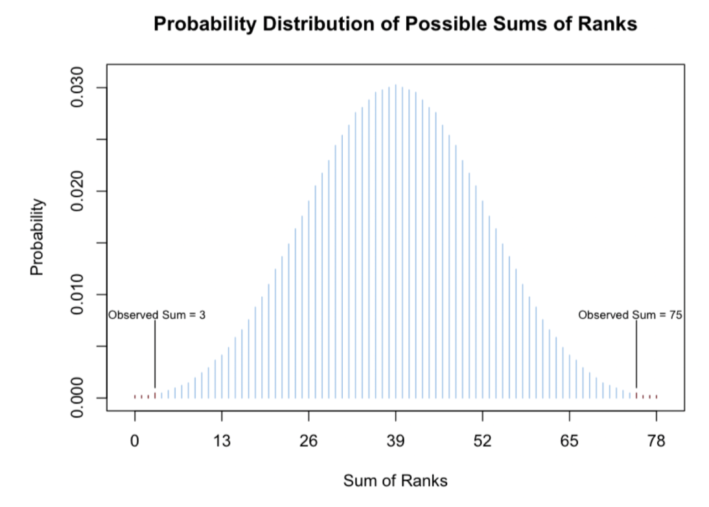
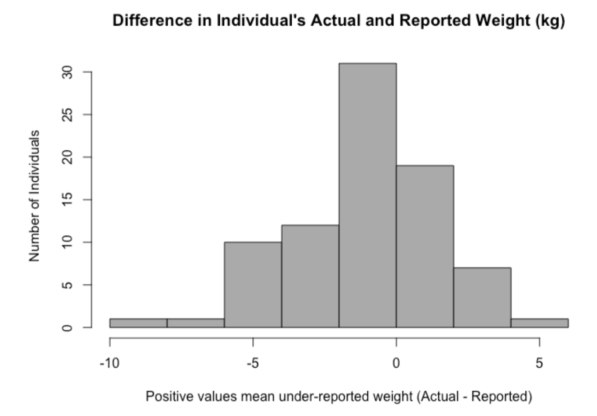

<!--******************************************************
LAST UPDATED: June 5th, 2025
BY: Andrew Seaman
*******************************************************-->


<!-------------------------------------------------------
.                          SETUP                    
-------------------------------------------------------->

<!-- Format HTML Output -->
```{r setup, include=FALSE}
knitr::opts_chunk$set(echo = TRUE)
```

<!-- Libraries -->
```{r, message=FALSE, warning=FALSE, include=FALSE}
# Load
library(mosaic)
library(pander)
library(DT)
library(tidyverse)
library(car)
```

<!-- Colors -->
```{r}
red <- "indianred"
blue <- "dodgerblue"
```

<!-- END: Setup -->


<!-------------------------------------------------------
.                          QUESTIONS                    
-------------------------------------------------------->

<!-- Q1: Start -->

## Q1. Orientation
> _Let's get your bearings. Follow  these instructions:_

1. The CornHeights Example analysis for the Wilcoxon Signed-Rank Test shows a graphic that is a boxplot overlaid with a dot plot. This is a useful custom graphic that shows all of the data as well as the five-number summary of the data. What is the minimum value in that plot? (Hint: the table below the plot in the Example analysis shows the exact answer).
    * ___Minimum___: -67 

</BR>

2. The sleep Example analysis for the Wilcoxon Signed-Rank Test performs a Wilcoxon Signed-Rank Test that uses a continuity correction. What is the p-value of this test?
    * ___p-value___: 0.009091
    
</BR>

3. The BugSpray Example analysis for the Wilcoxon Rank Sum Test performs a Wilcoxon Rank Sum Test that has a test statistics of what?
    * ___W___: 55

</BR>

4. The probability of getting a test statistic at least this extreme if the null hypothesis is true is what?
    * ___p-value___: 0.01771

---

<!-- END: Q1. -->


## Q2. Quick Trivia
> _Here are some quick trivia questions to test your knowledge of the Wilcoxon Tests._

1. Which style of tests can be performed with the Wilcoxon Signed-Rank Test?
    * ___One Sample___: testing hypotheses about the center of a distribution (where the center is subtracted from each value).
    * ___Paired Samples___: testing hypotheses about the center of the distribution of differences.
    
</BR>

2. Which style of tests can be performed with the Wilcoxon Rank Sum Test?
    * ___Independent Samples___: test of the difference in the location of the centers of two distributions.
    
</BR>

3. _True or False_. The Wilcoxon Rank Sum Test, also known as the Mann-Whitney Test, is the nonparametric equivalent of the Independent Samples t Test.
    * ___T/F___: TRUE
    
</BR>

4. _True or False_. The Wilcoxon Signed-Rank Test was originally created to test hypotheses about the value of the median, but can be used to test hypotheses about the mean when data is symmetric. 
    * ___T/F___: TRUE
    
</BR>

5. _True or False_. Both the Wilcoxon Rank Sum Test and the Wilcoxon Signed-Rank Test ignore the specific values of the data and only utilize the relative positions of the data, i.e., the ranks, hence the reason they are often called Rank-Based Tests.
    * ___T/F___: TRUE
    
</BR>

6. _True or False_. The sampling distribution of the test statistic for any of the Wilcoxon Tests is a normal distribution.
    * ___T/F___: FALSE
    * However, the distribution of the Wilcoxon Test Statistic can be usefully approximated by a normal distribution when the sample size of the data being used in the test is large. However, this distribution of the test statistic can never be exactly normal because the test statistic can only ever be a whole number.
    
</BR>

7. The various t Tests (from last week's material) are  <span style="border: 2px solid black; padding: 3px;">___parametric___</span> tests while the Wilcoxon Tests are <span style="border: 2px solid black; padding: 3px;">___nonparametric___</span> tests. This is because t Tests rely on t distributions (which are parametric distributions) to calculate the p-value while Wilcoxon tests use sums of ranks and mathematical counting techniques (a nonparametric distribution) to calculate the p-value.

---

<!-- END: Q2. -->


## Q3. Signed-Rank Test
> _This question and the next one will guide you through how the Wilcoxon Signed-Rank Test works. </BR></BR>
Note: Be sure to use the Example Analyses for the Wilcoxon Signed-Rank Test as found in the Statistics-Notebook as a guide while you work through this problem._

### Background

<div style="color:`r red`;">

An online website reports that the 2010 Honda Odyssey should get 17 miles per gallon (mpg) during city driving conditions. A family has kept track of their gas mileage data for their 2010 Honda Odyssey since June 2020. They want to know if they are typically getting 17 mpg or not, and have provided us with a systematic sample of their mpg records. 

Run the following code in R to input their data into R (see code chunk).

</div>

```{r}
# Define example dataframe
Honda_mpg <- data.frame(
  date = c(
    "06/01/20", "08/19/20", "09/14/20", "01/07/21", "07/22/21", "08/16/21", 
    "10/24/21", "12/31/21", "03/12/22", "05/04/22", "07/09/22", "10/12/22"), 
  milesDriven = c(274.4, 266.8, 317.0, 113.4, 326.2, 62.6, 239.8, 242.0, 195.6, 106.4, 379.3, 325.4), 
  gallonsUsed = c(12.42, 12.255, 15.224, 7.953, 16.378, 3.285, 13.230, 10.467, 9.310, 4.721, 16.958, 16.221)
)
```

```{r, include=FALSE, echo=FALSE}
# View the dataframe
View(Honda_mpg)
```

### Hypotheses

<div style="color:`r red`;">

Use a mutate statement to create an mpg column in the data set that divides the milesDriven by the gallonsUsed. (Keep the name of the dataset Honda_mpg as you add this new column.)

</div>

```{r}
# Add mpg column
Honda_mpg <-Honda_mpg %>% 
  mutate(
    mpg = milesDriven / gallonsUsed
  )
```

```{r, include=FALSE, echo=FALSE}
# View new dataframe
View(Honda_mpg)
```

1. To verify that you have correctly made this column, state the mpg for 07/22/21 in the data. _(Round to 2 decimal places)_
    * ___MPG (07/22/21)___: 19.92 mpg
    
</BR>

2. We will use this mpg column to see if the family is getting 17 mpg, on median. (The median is being used here so that potential outliers do not overly sway the results.) Select the hypotheses that are most appropriate for using the Wilcoxon Signed-Rank test on the mpg data.

$$
H_0: {\text{Median mpg}} = 17
\\
H_a: {\text{Median mpg}} \neq 17
$$

<div style="color:`r red`;">

We will use a significance level of  α = 0.05.

</div>

### Graphic and Analysis

<div style="color:`r red`;">

To visualize what the Wilcoxon Signed-Rand Test is testing, create a dotplot in R of the mpg data that includes a vertical line representing the null hypothesis of our test.

_Hint_: library(tidyverse) needs to be loaded for the following code to run.

Complete the following code in order to create this graphic (see chunk):

</div>

* ___Data___: Honda_mpg
* ___x___: mpg

```{r, warning=FALSE, fig.height=1.3, fig.width=6}
dotplot <- (
  ggplot(Honda_mpg, aes(x = mpg)) +    
    geom_dotplot(binwidth = .1) +   
    geom_segment(aes(x = 17, xend = 17, y = 0, yend = 0.4), color = "black") +
    geom_label(aes(x = 17, y = 0.6), 
               label = "Median Hypothesized to be 17 mpg", 
               color = "white", fill = "black"
    ) +
    labs(
      title = "2010 Honda Odyssey Gas Mileages", 
      y = "", 
      x = "Miles Per Gallon Vehicle Achieved on Systematically Selected Dates") + 
    theme(
      axis.ticks.y = element_blank(), 
      axis.text.y = element_blank(),
      panel.grid = element_blank(),
      axis.line.x = element_line(color = "black")
    )
)
show(dotplot)
```

3. Confirm that you have correctly made this plot in R by stating the values labeled A and B on the graph showing above.
    * ___A___: 14
    * ___B___: 20
    
</BR>

4. Just looking at the plot, which conclusion seems most reasonable.
    * ___The median looks to be___: higher than 17 mpg.
    
</BR>

<div style="color:`r red`;">

Conduct the actual hypothesis test in R using a Wilcoxon Signed-Rank test to test if the mpg data has a median of 17:

</div>

```{r}
# Wilcoxon Signed-Rank Test (Honda_mpg)
results_signed_rank <- wilcox.test(Honda_mpg$mpg, mu = 17, alternative = "two.sided", conf.level = 0.05)
pander(results_signed_rank)
```

5. What is the value of the test statistic?
    * ___W___: 75

</BR>

6. What is the probability that the test statistic would be as extreme or more extreme than this value?
    * ___p-value___: 0.002441
    
</BR>

7. What conclusion does this probability give us?
    * ___There is___: sufficient evidence to reject the null hypothesis (p-value less than the significance level). We will conclude that the true median gas mileage of this vehicle is something different than 17 mpg.
    
</BR>

8. Compute the median of this sample of gas mileages. _(Round to 2 decimal places.)_
    * ___Sample median___: 20.92 mpg
```{r}
# Compute the median mpg
median_mpg <- round(median(Honda_mpg$mpg), digits = 2)
```
  
</BR>

<div style="color:`r red`;">

It appears that this Honda Odyssey is getting closer to <u>21 miles per gallon</u> on median rather than the listed <u>17 miles per gallon</u>, which is great!

Now go on to the next question to take a deeper look at how the Wilcoxon Signed-Rank Test is actually testing the median of 17 mpg.

</div>

---

<!-- END: Q3. -->


## Q4. Signed-Rank Test - Median
> _In the previous question, we used R's wilcox.test to test the hypothesis that the median of the Honda_mpg$mpg data was equal to 17. In this question, we will work through the test by hand to show how the test actually works. (Note that only a mathematician would be interested in doing this test by hand in general, but it is useful for you to do it by hand once to gain some understanding on how rank-based tests, like this test, work.)
</BR></BR>
It is recommended that you have your "Explanation" tab of your "Wilcoxon Signed-Rank Test" page of your Statistics Notebook open to the "One Sample Example" that is found towards the end of that Explanation section. Once there, follow the five steps for the "One Sample Example." Answer the following questions to test your understanding of these five steps._

1. Recreate the dot plot used in the previous question.
```{r, warning=FALSE, fig.height=1.3, fig.width=6}
# Show dotplot from Q3 (same chunk rendering specs)
show(dotplot)
```
    
</BR>

2. Before beginning Step 1 (as found in the Explanation tab, One Sample Example of the Wilcoxon Signed-Rank Test) we need to calculate what are called the "differences". As stated in your textbook, "The differences are obtained by subtracting the hypothesized value for the <span style="border: 2px solid black; padding: 3px;">___median___</span> from all observations." 

<div style="color:`r red`;">

This is done in R with the code (see chunk):

</div>

```{r}
# Calculate the differences
hyp.median_mpg <-  17 # mpg
differences_mpg <- Honda_mpg$mpg - hyp.median_mpg # differences

# Mutate the dataframe to include the above
Honda_mpg <- mutate(Honda_mpg,
  hyp.median_mpg = hyp.median_mpg,
  differences = differences_mpg
)
```

```{r, include=FALSE, echo=FALSE}
# View the dataframe
View(Honda_mpg)
```

</BR>

3. The fourth value in these computed differences has what value?
    * ___Fourth difference___:`r differences_mpg[4]`
    
</BR>

4. Importantly, it is the only negative difference that was computed. In other words, only one value is below the hypothesized median of 17 mpg. So only one value will be in the "negative differences" group. Let's locate this point in the dot plot you created previously. Click on the dot in the plot shown below that corresponds to this negative difference.
    * ___Selection___: It's the dot next to 14.
    
</BR>

5. Sort the differences by magnitude and rank them. Then apply the same sign of the respective difference to its rank.
```{r}
# Rank the differences by magnitude and apply the sign of the difference values to their ranks.
x <- differences_mpg

differences_abs <- abs(x)
ranks <- rank(abs(x))
signed_ranks <- ranks * sign(x)

# Mutate the dataframe to include the absolute value of the differences.
Honda_mpg <- mutate(
  Honda_mpg,
  differences_abs = differences_abs,
  ranks = ranks,
  signed_ranks = signed_ranks
)

# View the new columns (differences and signed_ranks)
quick_view <- Honda_mpg %>% 
  select(differences, differences_abs, ranks, signed_ranks) %>% 
  arrange(ranks) %>% 
  pander()

quick_view
```

```{r, include=FALSE, echo=FALSE}
# View the dataframe
View(Honda_mpg)
```

</BR>

<div style="color:`r red`;">

(Remember: if there is a tie between two ranks, then the ranks of the two values are averaged together. Fortunately, there were no ties in this data.)

<!-- Question 6 calculations -->
At this point, we could either add up the sum of the positive ranks, or the sum of the absolute value of the negative ranks. Since there is only one negative rank, that seems like the easiest way to proceed, which would give us a sum of  |−3|=3. However, to match how R computed the test statistic, we will need to sum up the positive ranks?

</div>

</BR>

```{r, include=FALSE}
# Sum of positive ranks
sum_positive_ranks <- sum(signed_ranks[signed_ranks > 0])
```

6. What is the sum of all positive ranks?
    * ___Sum (i.e. test statistic)___: `r sum_positive_ranks`

</BR>

7. Note that this answer is exactly the same as the value of the test statistic that you obtained in your test in R from the previous question! To see this, rerun the `wilcox.test()` from the previous question. What letter does the wilcox.test() output in R use for the Wilcoxon Test statistic?
```{r, warning=FALSE}
# Rerun the Wilcoxon Signed-Rank Test
results_signed_rank
```

* ___Test statistic symbol___: V

<div style="color:`r red`;">

This shows that the test statistic of the Wilcoxon Test in R is the sum of the ranks from the positive ranks.

</div>

</BR>

8. There are two things needed to calculate the p-value of a hypothesis test. Which of these two things have we calculated so far?
    * ___We've calculated___: a test statistic (__V__ = `r sum_positive_ranks`) only.
    
</BR>

<div style="color:`r red`;">

So, to calculate the p-value, we must now come up with all of the possible values that the test statistic could have been obtained, and compute the probability of each such value occurring. This is known as the distribution of the test statistic.

First, note that it could have been possible that none of the values were less than 17 mpg (so all ranks would belong to the positive group).

</div>

```{r, include=FALSE}
# Sum all ranks if they were all positive
sum_ranks_all_pos <- sum(ranks)
```

9. In this case, the sum of the positive ranks would have been what?   
    * ___Sum___ = `r sum_ranks_all_pos`
    
</BR>

<div style="color:`r red`;">

Also, it could have been possible that all of the values were less than 17, so that all ranks belonged to the negative group.

</div>

10. In this case, the sum of the positive ranks would have been what?
    * ___Sum___ = 0

<div style="color:`r red`;">    

This is what you get when you have no positive ranks in the data.

</div>

</BR>

11. This means that the test statistic of the Wilcoxon Test could have been any whole number between <span style="border: 2px solid black; padding: 3px;">___0___</span> and <span style="border: 2px solid black; padding: 3px;">___78___</span>.

<div style="color:`r red`;">

That is a lot of possibilities! If we draw the plot of the distribution of all possible test statistics (sums of ranks) we get the following plot. The lines are so close together it is starting to look a lot like a normal distribution. This is an amazing result because the Wilcoxon Test is a nonparametric test, so no assumptions about normality of the data were made! In the graph below we compute the probability of the region that is as extreme or more extreme than the observed test statistic of 75 (or 3 if the negative ranks were summed). This results in the following picture where the very tips of the two tails are shaded in red.

</div>

</BR>



</BR>

12. Thus, the p-value is calculated by adding up the <span style="border: 2px solid black; padding: 3px;">___probability___</span> of all the possible sums of ranks that are as extreme or more extreme than the observed sum of ranks. Since it is impossible to tell the heights of the red bars showing in the plot above, they are listed in the following table for you so that you can add them up to get the p-value.
    
```{r, include=FALSE}
# New dataframe: red bars from the plot above (image not included).
distribution <- data.frame(
  `Possible Sum of Positive Ranks` = c(
    0, 1, 2, 3, 75, 76, 77, 78),
  Probability = c(
    0.0002441406, 0.0002441406, 0.0002441406, 0.0004882812, 
    0.0004882812, 0.0002441406, 0.0002441406, 0.0002441406)
)

# Compute p-value and store as a sting for clean output later.
p_value <- sum(distribution$Probability)
p_value_string <- as.character(p_value)
```

</BR>

13. Thus, using the table of probabilities above, the p-value of this particular test gives a result of (accurate to 10 decimal places): 
    * ___p-value___ = `r p_value_string`
    
</BR>

14. What was the P-value R reported when the Wilcoxon Signed-Rank test was performed in R?
    * ___p-value___ = 0.002441
    
</BR>

<div style="color:`r red`;">

Well that's happy, the answers match. So now you know what R is doing when you run the Wilcoxon Signed-Rank Test. The process is similar for the Wilcoxon Rank Sum Test, with a few important differences due to the fact that there are two groups of data instead of a "postive" and "negative" group. Remember, unless you are a mathematician, you'll never have reason to do this Wilcoxon Test "by hand" like we just did. This was just to help you understand how rank-based tests operate, which is a valuable insight to keep in mind as you perform wilcox.test(...) in R.

</div>

---

<!-- END: Q4. -->


## Q5. Using R - Wilcoxon tests
> _This final set of questions is to help you verify that you can use R to answer research questions that utilize the Wilcoxon Tests._

<div style="color:`r red`;">

Consider the Duncan dataset in R. (Ensure library(mosaic) and library(car) are loaded.)

</div>

1. Filter the data set to just show "wc" and "prof" types of occupations (code chunk)
```{r}
# Filter data set
Duncan2 <- Duncan %>% 
  filter(type %in% c("wc", "prof"))
```
    
</BR>

<div style="color:`r red`;">

Use an appropriate Wilcoxon Test that would answer the following question using the Duncan dataset in R. 

</div>

2. Are prestige scores typically higher for professional and managerial type occupations than for white-collar occupations? (Be sure to use alternative="greater" in your test to match the alternative hypothesis chosen below. Note that R chooses the alphabetically first group to be "Group 1", "prof" in this case, and the other group to be "Group 2", "wc" in this case.)

$$
H_0: \text{Median}_\text{prof} - \text{Median}_\text{wc} = 0 
  \\
H_a: \text{Median}_\text{prof} - \text{Median}_\text{wc} \neq 0
$$

```{r}
# Wilcoxon Rank Sum Test
wilcox.test(prestige ~ type, mu = 0, alternative = "greater", conf.level = 0.05, data = Duncan2)
```

</BR>

3.  Type of test?
    * ___Test___: Wilcoxon Rank Sum Test
    
</BR>

4. Test statistic?
    * ___W___: 107
    
</BR>

5. P-value?
    * ___P-value___: 0.0002293

</BR>

6. Conclusion?
    * ___Conclusion___: Reject the null.
    
</BR>

7. There is <span style="border: 2px solid black; padding: 3px;">___sufficient___</span> evidence to conclude that prestige scores are typically higher for professional and managerial occupations than for white-collar occupations. To quantify the difference in prestige scores and how much higher they are for professional and managerial occupations than for white-collar occupations, we can create side-by-side boxplots and a table of the five-number summary.
    
</BR>

8. Recreate the following graph in R. 

<div style="color:`r red`;">

Note: If you are getting three groups along your x-axis instead of just two, use data=droplevels(nameOfYourDataSet) instead of just data=nameOfYourDataSet in your boxplot(...) code. This removes the unused "level" of type that you filtered out previously.

</div>

```{r, warning=FALSE}
# Recreated graph:

ggplot(Duncan2, aes(x = type, y = prestige, fill = type)) +
  # Side-by-side boxplot. Initially turn on dashed lines
  geom_boxplot(linetype = "dashed", outlier.shape = 21) +
  # Draw box (solid line) around either box
  stat_boxplot(aes(ymin = ..lower.., ymax = ..upper..), 
               outlier.shape = 21, 
               outlier.color = "black", 
               outlier.fill = "white", 
               outlier.size = 3) +
  # Add error bars at the max and min (outliers excluded)
  stat_boxplot(geom = "errorbar", aes(ymin = ..ymax..)) +
  stat_boxplot(geom = "errorbar", aes(ymax = ..ymin..)) +
  theme_classic() +  # <-- correct base theme
  scale_fill_manual(values = c("steelblue", "white")) +
  theme(
    # Title
    plot.title = element_text(face = "bold", size = 18, hjust = .5),
    # Legend
    legend.position = "none",
    # Axes
    axis.title = element_text(size = 16, color = "black"),
    axis.text = element_text(size = 14, color = "black"),
    axis.text.y = element_text(hjust = .5, angle = 90),
    axis.ticks = element_line(color = "black"),
    axis.ticks.length = unit(10, "pt"),
    # Plot area
    panel.border = element_rect(color = "black", fill = NA, size = 0.8)
  ) +
  labs(
    title = "Duncan Prestige of Occupations Data",
    x = "Type of Profession",
    y = "Prestige Score (Higher is More Prestigious)"
  )
```

</BR>

9. To prove that you have created this graph, what is the value of "A" that is shown on the corresponding location of the y-axis of your graph (from the image in the quiz)? 
    * ___A___: 100
    
</BR>

10. Recreate the following numerical summary table in R. 

<div style="color:`r red`;">

_(Hint:_ try library(mosaic) and favstats(Y ~ X, data=...) where Y is the quantitative data column name and X is the column name of the categorical data containing exactly two groups).

</div>

```{r}
# Subsets
pretige_prof <- Duncan2$prestige[Duncan2$type == "prof"]
pretige_wc <- Duncan2$prestige[Duncan2$type == "wc"]

# Favstats (pandered)

pandered_pretige_prof <- pander(favstats(pretige_prof))
pandered_pretige_wc <- pander(favstats(pretige_wc))
```

##### Type: `prof`
`r pandered_pretige_prof`

##### Type: `wc`
`r pandered_pretige_wc`

</BR>

11. From these results, we see that professional type occupations have a median prestige score that is <span style="border: 2px solid black; padding: 3px;">___more than double___</span> the median prestige score of white-collar occupations.
    
</BR>

<div style="color:`r red`;">

Open the Salaries dataset in R. (Ensure the library(mosaic) is loaded.)

As shown in the help file for this data set, ?Salaries, this data was collected from the 2008-09 academic school year for colleges in the U.S. "as part of the on-going effort of the college's administration to monitor salary differences between male and female faculty members."

Also explained in the help file is that "rank" is "a factor with levels `AssocProf`, `AsstProf` and `Prof`". When trying to filter data, columns of data that are a "factor" can be frustrating to work with (as seen in the previous question). So sometimes it is easier to mutate(...) the data and change columns that are "factors" to "character".

</div>

12. Change the "rank" column of the Salaries data from "factor" to "character" by running the commands (code chunk):
```{r}
Salaries2 <- Salaries %>%
  mutate(rank = as.character(rank))
```

```{r, include=FALSE, echo=FALSE}
# View the dataframe
View(Salaries2) 

# Cols (6): "rank", "discipline", "yrs.since.phd", "yrs.service", "sex", "salary"   
```

</BR>

13. Then, recreate the following graph in R in order to explore any differences in salaries of male and female Professors at colleges across the U.S. in 2008-09.
```{r, warning=FALSE}
# Recreated graph:

ggplot(Salaries2, aes(x = sex, y = salary)) +
  # PRIMARY: Side-by-side boxplot. Initially turn on dashed lines
  geom_boxplot(fill = "wheat3", 
    outlier.shape = 21, outlier.color = "black", outlier.fill = "white", outlier.size = 3
  ) +
  # DETAIL: Error bars at the max and min (outliers excluded)
  stat_boxplot(geom = "errorbar", aes(ymin = ..ymax..)) +       # Top bars
  stat_boxplot(geom = "errorbar", aes(ymax = ..ymin..)) +     # Bottom bars
  # PRIMARY: Base theme
  theme_classic() +
  # PRIMARY: y-axis range
  scale_y_continuous(
    limits = c(50000, 225000),  # set y-axis range — don't include 0
    breaks = c(100000, 150000, 200000),  # only these ticks will display
    labels = scales::dollar
    ) +
  # DETAIL: Theme (adjustments to the base theme)
  theme(
    # Title
    plot.title = element_text(face = "bold", size = 16, hjust = .5),
    # Legend
    legend.position = "none",
    # Axes (x &)
    axis.title.y = element_text(size = 14, color = "black"),
    axis.title.x = element_blank(),
    axis.text = element_text(size = 14, color = "black"),
    axis.text.y = element_text(hjust = 0.5, angle = 90),
    axis.ticks = element_line(color = "black"),
    axis.ticks.length = unit(10, "pt"),
    # Plot area
    panel.border = element_rect(color = "black", fill = NA, size = 0.8)
  ) +
  # DETAIL: Labels
  labs(
    title = "Do Male Prof's Earn Higher Median Wage?",
    # subtitle = "(Student: Andrew Seaman)",
    y = "Annual Salary (USD)\n"    # Add a new line bewteen the label and text.
  )
```

</BR>

14. Compute appropriate numerical summaries in R to determine the median wages, and sample sizes, for Male and Female Professors.
```{r}
# Summary: Professor, median salary, sample size
Salaries2 %>% 
  filter(rank == "Prof") %>% 
  group_by(sex) %>% 
  summarise(
    `Median Annual Salary` = median(salary),
    `Sample Size (n)` = n()
  ) %>% 
  rename(Professor = sex) %>% 
  pander()
```

</BR>

<div style="color:`r red`;">

It is possible that any differences we are seeing in the salaries of the male Professors are simply due to random chance differences in the men and women we sampled in this data. So before we make any real conclusions here, it is important to test the data.

Run an appropriate Wilcoxon Test in R to determine if salary is stochastically different for one of the genders of Professors. (The professors in this data will act as a representative sample for the population of professors from all universities.) Use the significance level of α=0.05 for your test.

</div>

15. What are the test results?
```{r}
# First: Subset to only "Prof"
Salaries3 <- Salaries2 %>%
  filter(rank == "Prof")

# Wilcoxcon Sum Rank Test
Salaries3 %>% 
  wilcox.test(salary ~ sex, mu = 0, alternative = "two.sided", conf.level = .05, data = .)
```

```{r}
# Difference of Median Salary

## Calculate medians by sex — with summarise and pipe!
salary_summary <- Salaries3 %>%
  group_by(sex) %>%
  summarise(`Median Salary` = median(salary), .groups = "drop")


### Male
median_male_prof <- salary_summary %>%
  filter(sex == "Male") %>%
  pull(`Median Salary`)

### Female
median_female_prof <- salary_summary %>%
  filter(sex == "Female") %>%
  pull(`Median Salary`)

#### Difference
salary_diff <- median_male_prof - median_female_prof
formatted_salary_diff <- scales::dollar(salary_diff, accuracy = 1)
```

</BR>

16. What are the test results?
    * ___Type of Test___: Wilcoxon Rank Sum Test
    * ___Test Statistic (W)___: 2071.5
    * ___P-value___: 0.6117
    * ___Conclusion___: Fail to reject the null.
    * ___There is___: <span style="border: 2px solid black; padding: 3px;">___insufficient___</span> evidence to conclude that salary is stochastically different for one of the genders of professors. In looking back at our numerical summaries and graphical summary, we see that it appears that male Professors are being paid a median salary that is <span style="border: 2px solid black; padding: 3px;">___`r formatted_salary_diff`___</span> more than the median female salary. Further research into why this discrepancy exists would be warranted though this discrepancy itself does not prove anything further than a pay gap in median salaries of Professors. We can't claim that discrimination or any other reason in particular has caused the pay gap without further research. But this difference certainly warrants further research into the "why" behind the gap. The gap has been shown to exist by the analysis above. We just don't have any explanation as to why it is there.
    
</BR>

<div style="color:`r red`;">

Open the Davis dataset in R. (Ensure the library(car) and library(mosiac) are loaded.)

</div>

17. Filter the Davis data to be just for men.
```{r}
# Subset 'Davis' dataset
Davis2 <- Davis %>% 
  filter(sex == "M")
```
    
</BR>

<div style="color:`r red`;">

As shown in the help file of this dataset, ?Davis, this data is about individuals who were "engaged in regular exercise." Use an appropriate Wilcoxon Test to decide if it is true that men who work out regularly over or under report their weight. (In other words, are men that work out regularly likely to report they weigh more or less than they actually do?)

Let the null hypothesis be that the median of the differences in actual and reported weights are equal to zero. Let the alternative hypothesis be that they are different from zero. (Make sure the order is Actual - Reported weight.)

</div>

$$
H0: {\text{Median of the differences}} = 0
\\
Ha: {\text{Median of the differences}} \neq 0
$$

<div style="color:`r red`;">

The first step to this type of analysis (where we are comparing each man's actual weight to their reported weight) is to compute the differences between the actual weight and reported weight for each person in the dataset using a mutate statement. Name the new column containing these differences something like "weight_diff".

Your code should look something like this (see chunk):

</div>

```{r}
Davis3 <- Davis2 %>%
  mutate(weight_diff = weight - repwt) # Compute the differences in actual weight minus reported weight
```

```{r, include=FALSE, echo=FALSE}
# View dataset
View(Davis3)
```

18. Now that the weight differences have been computed, create a graphic of the weight differences. Recreate the graph shown below, or one similar.

### Example plot
<div style="border: 5px solid green;">

</div>

### Plot Recreation
```{r, warning=FALSE}
# Recreate the plot (histogram):

# Bin details
bins = 8
binwidth <- 2
boundary <- 0 # Possibly unnecessary
center <- 0 # Origin is not a valid parameter

# Plot
ggplot(Davis3, aes(x=weight_diff)) +
  # Plot
  geom_histogram(fill = "darkgrey", color = "black",
    # bins = bins,
    binwidth = binwidth,
    boundary = boundary
    # center = center
  ) +
  geom_vline(xintercept = 0, color = blue, linetype = "dashed", size = 1.5) +
  # Axes
  guides(
    x = guide_axis(cap = "both"), ## Cap both ends
    y = guide_axis(cap = "both") ## Cap the upper end
  ) +
  scale_y_continuous(n.breaks = 7, limits = c(0, 32)) +
  # scale_x_continuous(limits = c(-10, 6)) +
  labs(
    title = "Difference in Individual's Actual and Reported Weight (kg)",
    x = "\nPositive values mean under-reported weight (Actual - Reported)",
    y = "Number of Individuals\n"
  ) +
  # Theme
  theme_classic() + ## Default
  theme(            ## Custom
    plot.title = element_text(face = "bold", hjust = .5, size = 14),
    axis.title = element_text(size = 12),
    axis.text = element_text(size = 12),
    axis.text.y = element_text(hjust = 0.5, angle = 90),
    axis.ticks.length = unit(10, "pt")
  )
```

<div style="color:`r blue`;">

_Note_: I added a blue vertical line to denote a critical boundary related to the overall plot interpretation.

</div>

</BR>

```{r}
# Median weight difference
median_diff <- median(Davis3$weight_diff, na.rm = TRUE)
```


19. This graph is difficult to read at first. But as you study it carefully, you should come to recognize that any value to the left of zero shows men whose weight difference is negative. This means that their reported weight was a larger number than their actual weight. We know this because of the order of subtraction we used, actual - reported. This histogram shows more than half the data is to the left of 0. This means that more than half the men had a negative weight difference, or that they <span style="border: 2px solid black; padding: 3px;">___said they weighed more than they actually did___</span>. </BR></BR>In fact, the median weight difference is <span style="border: 2px solid black; padding: 3px;">___`r median_diff`___</span>pounds, showing the median reporting is half a pound higher than what the men actually weighed.
    
</BR>

22. Perform an appropriate Wilcoxon Test to determine if this -0.5 pound difference in Actual - Reported weights is significant. 
```{r}
# Wilcoxon Signed Rank Test
wilcox.test(Davis3$weight, Davis3$repwt, mu = 0, paired = TRUE, alternative = "two.sided", conf.level = 0.05, data = Davis3) 
```


21. Your Answer: 
    * ___Type of Test___: Wilcoxon Signed Rank Test
    * ___Test Statistic (V)___: 890.5 
    * ___P-value___: 0.08129
    * ___Conclusion___: Fail to reject the null at the 0.05 level of significance.
    * ___There is___: <span style="border: 2px solid black; padding: 3px;">___insufficient___</span> evidence to conclude that men who work out regularly over report their weight by 0.5 lbs on median.

---

<!-- END: Q5. -->


<!-- END: Questions -->


<!-- -------- -->
<!-- END: FILE -->
<!-- -------- -->